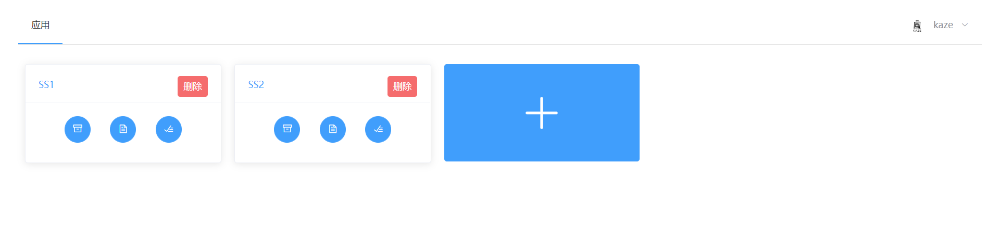

# Simple

第十一届 “中国软件杯”大学生软件设计大赛

A4-基于百度飞桨的遥感图像智能解译平台

- [x] 目标提取、变化检测、目标检测和地物分类四大分析功能
- [x] 自定义功能
- [x] 用户基本功能

[test.py](model/test.py) 为 Script 文件模板，请按照要求编写 Script

需要百度的框架，请安装 [PaddleRS](https://github.com/PaddleCV-SIG/PaddleRS)
